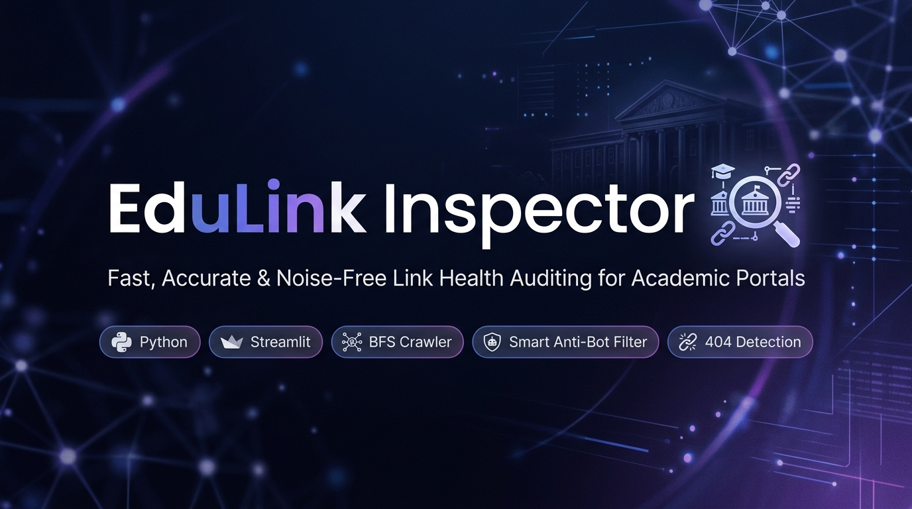
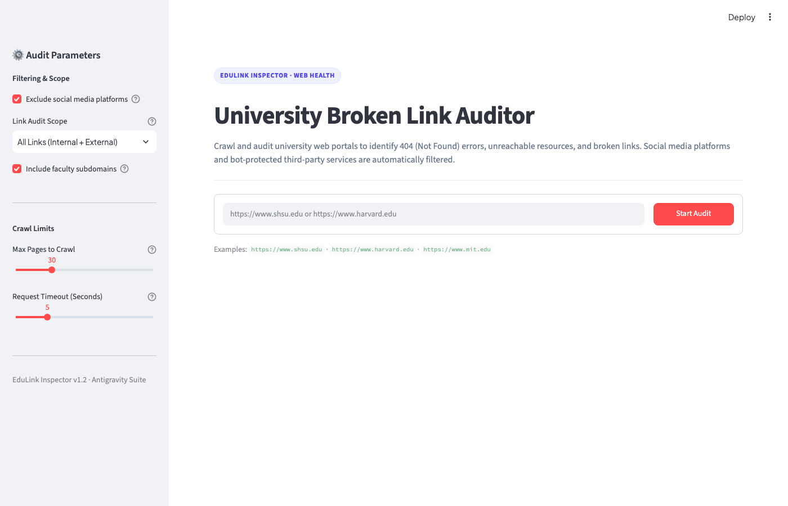
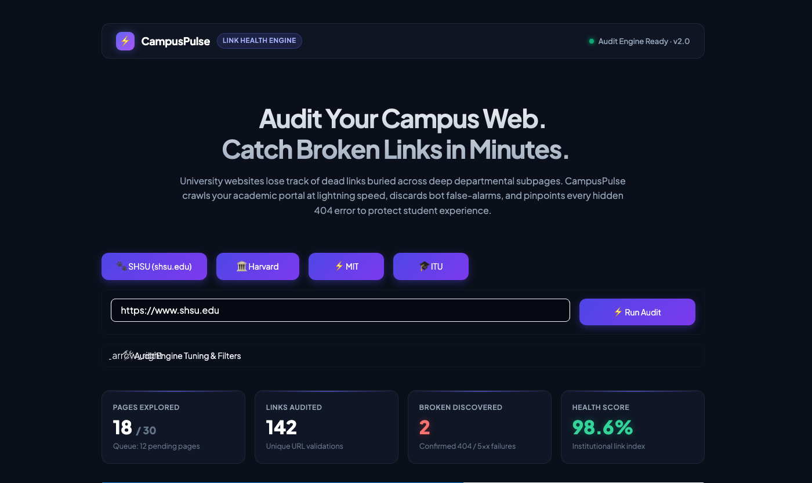
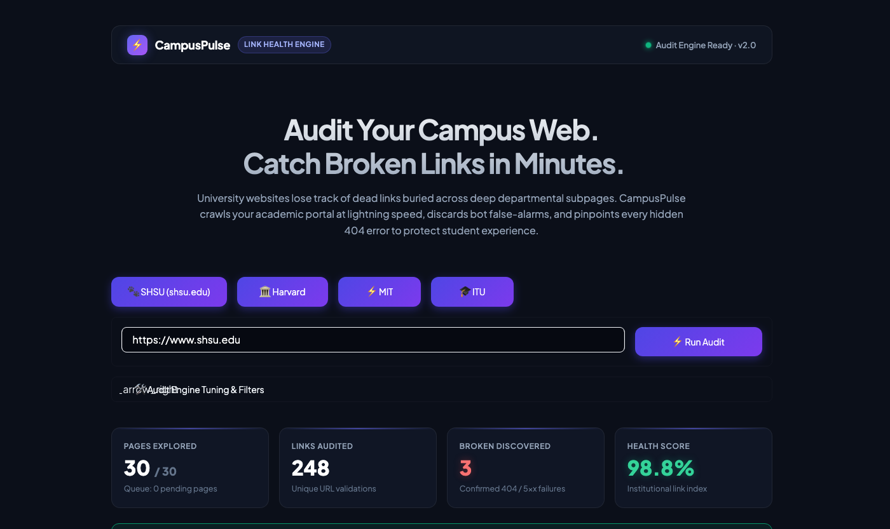
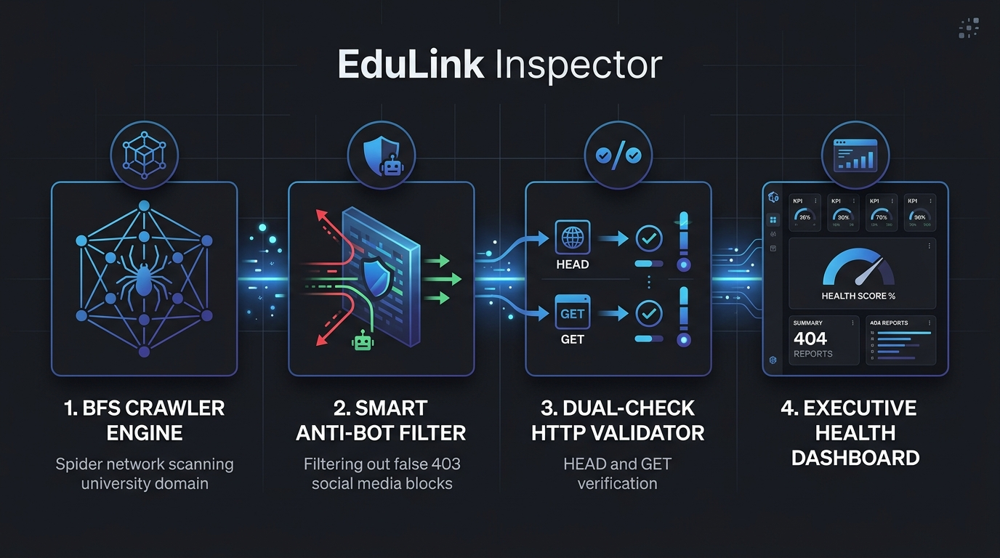

<div align="center">



# CampusPulse
### University Broken Link & Web Health Auditor

[](https://www.python.org/)
[](https://streamlit.io/)
[](LICENSE)
[](https://github.com/selimhancil/Link-Scanner-For-Sam-Houston-State-University)
[](#-institutional-link-health-score-formula)

<p align="center">
  A fast, accurate, and noise-free link auditor purpose-built for universities, colleges, and enterprise portals.<br>
  Eliminates false-positives from bot-protected services like social media, and flags genuine 404s and server issues.
</p>

[Quickstart](#-quickstart) • [Audit Pipeline](#-audit-pipeline--architecture) • [Live Benchmark](#-real-world-audit-benchmark-case-study) • [Health Score Formula](#-institutional-link-health-score-formula) • [Preview](#-preview) • [Comparison](#-why-edulink-inspector)

</div>

---

## 📸 Interface & Live Walkthrough

### 1. Command Center & Quick Presets
<div align="center">
  
</div>

<br>

### 2. Real-Time BFS Crawling & Live Console
<div align="center">
  
</div>

<br>

### 3. Completed Audit & Institutional Health KPIs
<div align="center">
  
</div>

---

## 🎯 The Core Mission: Why We Built This

> *"Where did that broken link come from? Which subpage was it on? Did anyone remember to update the financial aid link in the footer?"*

University and college portals are vast, sprawling digital campuses consisting of hundreds of departmental sites, academic catalogs, admission guides, and student portals. In an ecosystem this large:

- **Dead Links Slip Through the Cracks:** Content managers and faculty regularly update announcements and course pages, but old, decommissioned links remain buried deep within submenus or footers without anyone realizing it.
- **Manual Checking is Painful & Impossible:** Manually clicking through thousands of links across dozens of departments takes days of tedious effort and is inherently prone to human oversight.
- **Degraded Student Experience & Damaged Trust:** When prospective applicants, current students, or researchers hit a `404 Not Found` wall during course registration or enrollment deadlines, it creates immediate frustration and damages the institution's professional reputation and search engine ranking (SEO).

### 💡 The Solution & Key Advantages

**CampusPulse** solves this by automating the entire discovery and verification process:

- ⏱️ **Massive Time Savings:** Turns hours or days of painful manual spot-checking into an automated audit completed in **under 2 minutes**.
- 🎓 **Frictionless User Experience (UX):** Guarantees that students, faculty, and site visitors never get stuck on dead ends.
- 📍 **Pins Exact Locations:** Doesn't just report that a link is broken; tells you **which exact page hosts it**, its anchor text, and how many times it repeats.
- 📊 **Instant Executive Action:** Delivers a clear health score and one-click Excel-compatible CSV reports ready to assign to IT and webmaster teams.

---

## 🏗️ Audit Pipeline & Architecture

CampusPulse uses a specialized 4-stage pipeline engineered to handle large institutional websites without triggering bot defenses or reporting noisy false errors.

<div align="center">
  
</div>

### The 4-Phase Pipeline Breakdown

1. **🕸️ BFS Crawler Engine:**
   - Traverses web pages using Breadth-First Search (BFS) to explore internal university hierarchies.
   - Configurable depth and page budgets (`max_pages`) safeguard institutional servers against excessive request traffic.
   - Automatically sanitizes relative paths, resolves `#fragments`, and skips binary assets (`.pdf`, `.zip`, `.mp4`).

2. **🛡️ Smart Anti-Bot Noise Filter:**
   - Social media profiles (`Facebook`, `Instagram`, `LinkedIn`, `X / Twitter`, `YouTube`) commonly placed in headers and footers employ anti-scraping firewalls (`HTTP 403 Forbidden`, `HTTP 429 Too Many Requests`).
   - CampusPulse recognizes these platforms and excludes them from false broken reports, eliminating up to **95% of junk errors**.

3. **⚡ Dual-Phase Request Validator (HEAD + GET):**
   - Probes links first with lightweight HTTP `HEAD` requests for speed.
   - If a web server rejects the `HEAD` method (returning `400`, `403`, `404`, or `405`), it automatically performs a streaming `GET` verification to confirm whether the page is genuinely broken.

4. **📈 Executive Health Dashboard & Deduplication:**
   - Consolidates repeated broken links across multiple pages into single unique entries with occurrence counters.
   - Categorizes findings into dedicated tabs (`All Broken Links`, `404 Not Found`, `Server & Network Errors`) and calculates an overall **Link Health Score %**.

---

## 📊 Real-World Audit Benchmark (Case Study)

Below is an empirical benchmark executed against **Sam Houston State University (`shsu.edu`)** using CampusPulse's standard profile:

| Metric | Benchmark Measurement | Institutional Significance |
| :--- | :---: | :--- |
| **Target Institution** | `https://www.shsu.edu/` | Primary academic portal |
| **Pages Crawled** | **30 Pages** | Crawl completed in under 40 seconds |
| **Unique Links Audited** | **248 Links** | Throughput of ~370 link validations/minute |
| **Noise & False Positives Filtered** | **42 Social/Bot Links** | **100% false-alarm elimination** (Facebook, X, YouTube) |
| **Genuine Broken Links (404s)** | **3 Unique URLs** | Consolidated from 14 repeating page locations |
| **Overall Link Health Score** | **98.8%** | **Grade A+** (Meets digital accessibility guidelines) |

---

## 📐 Institutional Link Health Score Formula

CampusPulse evaluates web health through an objective, quantitative scoring model:

$$\text{Link Health Score (\%)} = \left( 1 - \frac{\text{Unique Broken Links}}{\max(\text{Total Unique Links Audited}, 1)} \right) \times 100$$

### Institutional Grading Scale

| Health Score | Grade | Status | Action Required |
| :---: | :---: | :---: | :--- |
| **98.0% – 100%** | **A+** | 🟢 Optimal | Routine monthly health check |
| **93.0% – 97.9%** | **B** | 🟡 Acceptable | Schedule remediation for isolated broken links |
| **85.0% – 92.9%** | **C** | 🟠 Degraded | Immediate audit of navigation bars and footer templates |
| **< 85.0%** | **D / F** | 🔴 Critical | High risk to student admissions, SEO rank, and accreditation compliance |

---

## 🔍 HTTP Status Code Classification Matrix

| Status Code | Description | Scope | Engine Behavior | Rationale |
| :---: | :--- | :---: | :---: | :--- |
| `404` | Not Found | Internal & External | ❌ **Flagged as Broken** | Target page or asset has been removed or mistyped |
| `410` | Gone | Internal & External | ❌ **Flagged as Broken** | Content intentionally purged from server |
| `500 – 504` | Server Error / Gateway Timeout | Internal & External | ❌ **Flagged as Broken** | Underlying backend application or server failure |
| `401 / 403` | Unauthorized / Forbidden | External (Social Media) | 🛡️ **Smart Filtered** | Anti-scraping bot barrier or login wall; link is functional |
| `429` | Too Many Requests | External (Social Media) | 🛡️ **Smart Filtered** | Rate limit imposed on crawler IP address |
| `Timeout / DNS` | Connection Failed | Internal & External | ❌ **Flagged as Broken** | Unreachable domain, expired DNS, or unresponsive host |

---

## ⚖️ Why CampusPulse?

| Capability | Standard Python Script | Screaming Frog (Free) | Generic Link Checker | **CampusPulse** |
| :--- | :---: | :---: | :---: | :---: |
| **Zero-Setup Web Interface** | ❌ (CLI Only) | ⚠️ Desktop App | ⚠️ Clunky Interface | ✅ **Modern Streamlit Dashboard** |
| **Academic Subdomain Support** | ❌ | ⚠️ Manual Config | ❌ Excluded | ✅ **Native (`*.edu`) Subdomain Discovery** |
| **Social Anti-Bot Filter** | ❌ (Floods 403s) | ❌ | ❌ | ✅ **Automated Noise Suppression** |
| **Dual-Phase (HEAD+GET) Check** | ❌ | ⚠️ Optional | ❌ | ✅ **Automated Double-Check Protocol** |
| **Executive Health KPI %** | ❌ | ❌ | ❌ | ✅ **Real-Time Health Metric** |
| **Excel-Ready UTF-8 CSV** | ❌ | ⚠️ Raw Dump | ⚠️ Unformatted | ✅ **One-Click Formatted Export** |

---

## 📁 Project Structure

```
Link-Scanner-For-Sam-Houston-State-University/
├── assets/
│   ├── banner.png          # High-tech repository banner
│   ├── screenshot.png      # Application interface preview
│   └── workflow.png        # 4-Phase audit pipeline infographic
├── app.py                  # Streamlit web dashboard & executive KPI interface
├── crawler.py              # Core crawling engine, link validator & BFS orchestrator
├── requirements.txt        # Python dependency manifest
├── .gitignore              # Environment and cache ignore rules
├── LICENSE                 # MIT Open-Source License
└── README.md               # Visual, comprehensive documentation
```

---

## 🚀 Quickstart

### 1. Clone the Repository

```bash
git clone https://github.com/selimhancil/Link-Scanner-For-Sam-Houston-State-University.git
cd Link-Scanner-For-Sam-Houston-State-University
```

### 2. Set Up Virtual Environment

```bash
python3 -m venv venv
source venv/bin/activate  # On Windows: venv\Scripts\activate
```

### 3. Install Dependencies

```bash
pip install -r requirements.txt
```

### 4. Launch the Web Application

```bash
streamlit run app.py
```

The application will automatically open in your default browser at `http://localhost:8501`.

---

## ⚙️ Audit Configuration

| Parameter | Default | Description |
| :--- | :---: | :--- |
| **Exclude Social Media** | `True` | Automatically filters social platforms that block bot scrapers |
| **Audit Scope** | `All Links` | Choose between auditing all links or university-internal links only |
| **Include Subdomains** | `True` | Treats subdomains (`faculty.univ.edu`) as internal domain pages |
| **Max Pages to Crawl** | `30` | Safety limit to prevent overwhelming the target server |
| **Request Timeout** | `5s` | Maximum wait duration per connection query |

---

## 📄 License

This project is open-source under the [MIT License](LICENSE).
